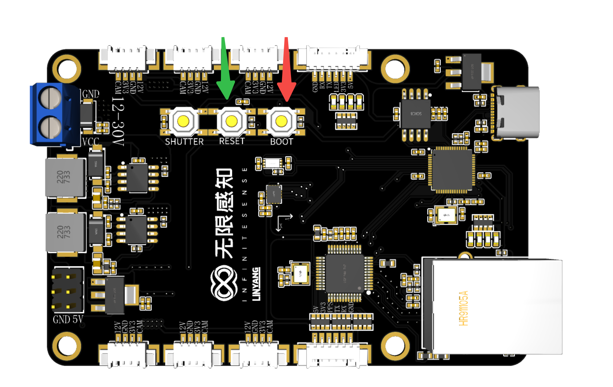
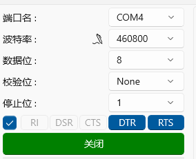
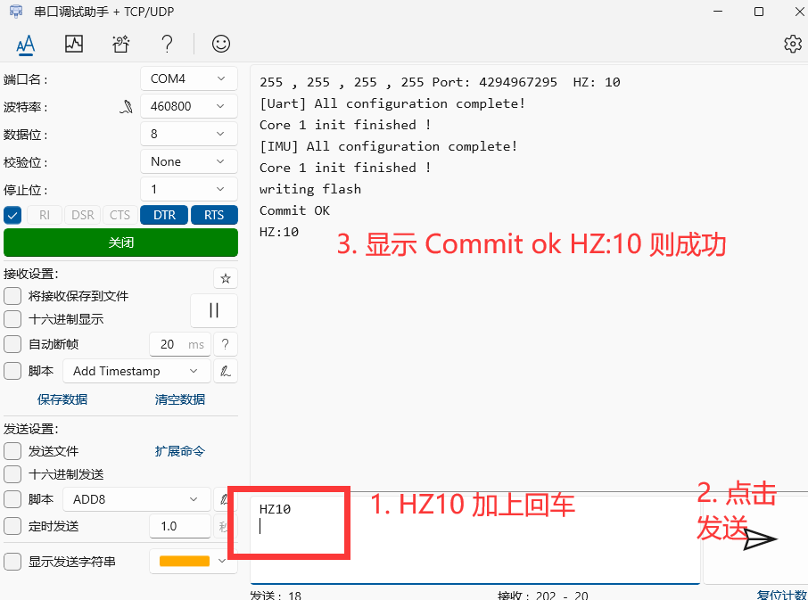
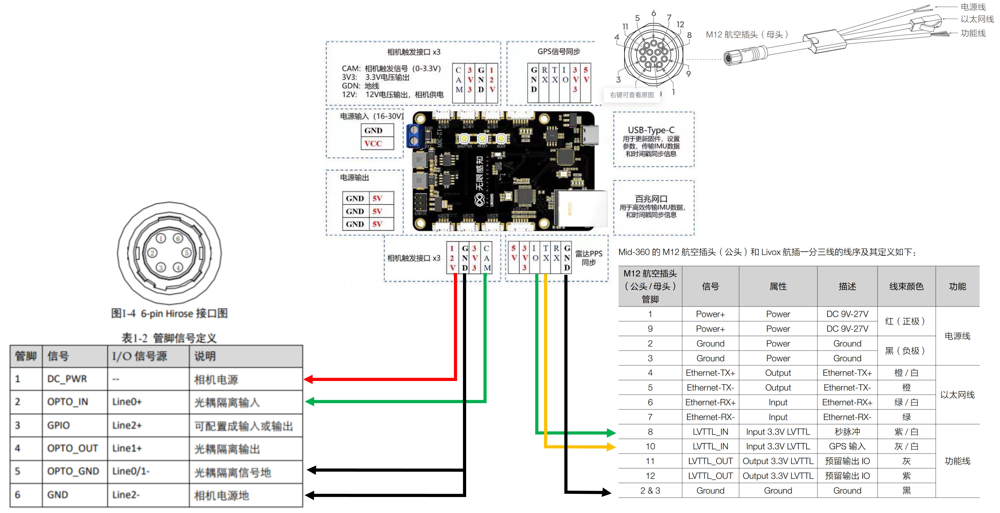
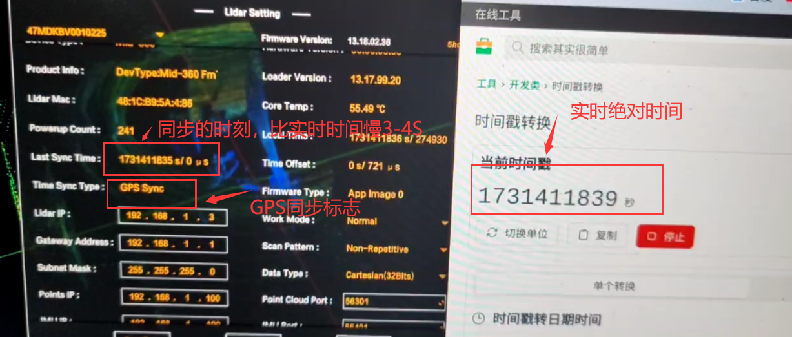

## 1. 更新固件

1. 接好Type-C线，电脑将弹出一个USB串口设备或者一个128M的小U盘，在Linux下的串口设备名称为 /dev/ttyACM0。 如果没有这一现象，请更换Type-C线，部分Type-C线材是不支持的，最好使用USB2.0的线。
2. 长按图中所示的RESET号按键不松开，然后短按一下BOOT号按键之后松开，会弹出一个128M的U盘。
3. 下载 firmware 目录下的 full_v3_xx_xx_xx_release.uf2 固件。将固件拖入U盘中，则U盘消失，多出来一个串口设备即为成功。固件是最新发布的固件，按日期使用最新的。



## 2. 设置同步频率

1. 按照步骤1更新固件为 full_v3_xx_xx_xx_release.uf2 固件
2. 连接串口助手，这里以win10自带的串口助手为例，配置参数为波特率 460800，数据位8， 校验位None，停止位1



3. 发送触发频率指令 `HZx\n`,其中x在1-60之间。注意在后面是有一个回车的，这里以发送`HZ10`为例



4. 发送IP更改指令 `IP192.168.1.168\n` *该IP地址与主机地址必须在同一个网段下*，请启动前确认可以通过ping功能测试连接。注意在后面是有一个回车的。
5. 发送端口号更改指令 `IO8888\n` 即更改端口号为8888。结合IP更改指令与端口号更改指令，可以方便的更改全功能板的网络地址
6重启，按照步骤1刷入最新固件。

## 3. 如何接线


1. 以工业相机为例。相机只需要四根线，一个触发线CAM、一个GND，一个12V相机电源，一个相机电源地，在这上面图片中已经非常清晰。
2. 雷达接线通常需要三根线，分别是同步版上面的GND,TX, IO。这里以常用的MID360为例展示接线。

## 4. 运行同步程序

1. 在linux系统上设置串口权限
2. 在终端运行ros，确保ros安装正确 `roscore`
2. 运行`demo`目录下的`uart_demo`

```
cd demo/udp_demo
mkdir build
cd build
cmake ..
make -j8
./udp_demo_ros_node
```

3. 在另一个终端中观察IMU数据

```

rostopic list
rostopic echo /imu

```

看到不断更新的IMU数据即为正常

## 5. 同步相机、雷达

当第四步完成之后，同步版将以1hz频率发送雷达同步信号，在雷达软件中可以看到同步效果。这里以MID360为例。




相机的同步的测试可以回到参数设置，将相机同步频率设置为1，然后在相机软件中观察多个相机的采集频率是否为1Hz,并且观察多个相机采集的时刻是否为同一个时刻。确保没问题后，再将参数修改会目标值，正常使用。

