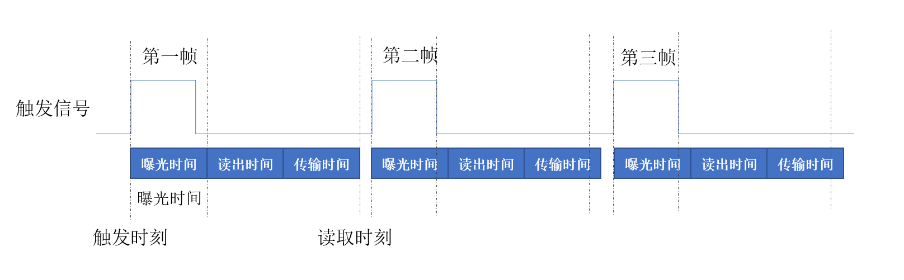
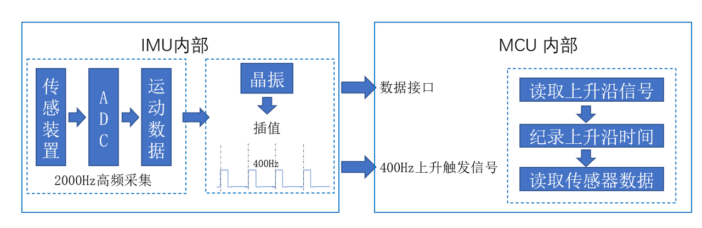
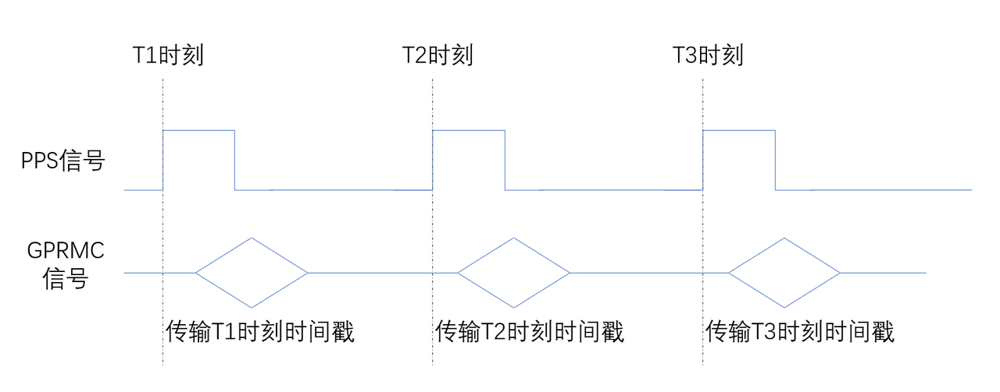
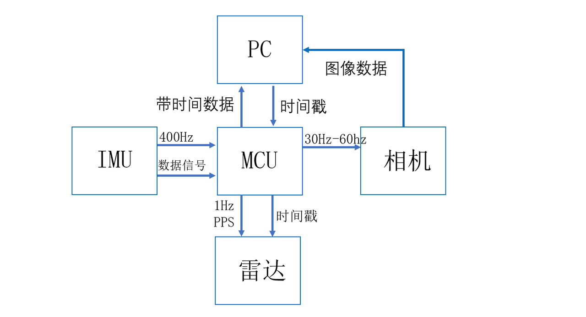
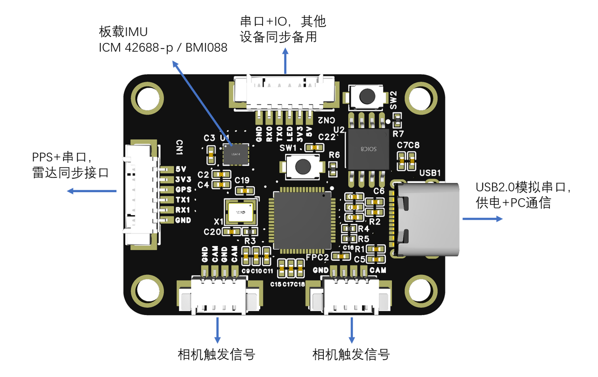

## 时间同步原理
以工控机的时间为基准，对雷达、IMU和相机时间戳进行精确的对齐。这三种传感器的时间定义方式各不相同，因此首先我们要知道传感器采集时间定义。其次，我们针对它们的时间定义，给出了一套完整的时间同步方案，能够达到us级的同步精度。
### 传感器时间定义
#### 相机
相机采集图像分为三个过程，其中第一步是采集触发，第二步是曝光，第三步是将模拟图像信号转换为数字信号。在上升沿的瞬间，相机打开快门，开始采集图像，在曝光时间内采集这个时间内的所有光信号，然后最后将光信号转换为数字信号。

图像采集得到的信息是开始曝光到结束曝光这段时间内的，因此我们将图像采集的时间定义为触发时间加上一半的曝光时间

$$
t_{cam}=t_{trigger}+\frac{t_{exposure}}{2}
$$

其中 $t_{cam}$ 是定义的相机时间， $t_{trigger}$ 是触发信号的时间， $t_{exposure}$ 是曝光时间。而如果采用USB相机读取图像的时刻作为图像时间，则和真实的采集时刻有一个较大的偏差。

#### IMU
对于VIO系统和LIO系统来说，IMU数据的频率应该越高越好例如1000Hz或者2000Hz，并且尽量不使用低通滤波器，或者配置尽量高频率的低通滤波器。然而实际使用时并不需要那么高的频率，大多数导航系统能够处理的IMU频率在200-400Hz左右。因此，通常会在IMU内部设置一个降采样的功能，自动插值得到对应频率的IMU信号，并通过引脚状态反馈。

如上图所示，是典型的MEMS的IMU传感器工作流程，IMU系统内部包含晶振时间系统，以2000Hz的频率进行内部数据采集，然后将其下采样到400Hz，进行自动的差值得到低频率的传感器数据。在IMU内部的数据准备好了之后，IMU的一个引脚被短时间拉高，被采集用于获得IMU的时间。所以IMU的传感器数据时间被定义为IMU特定引脚上升沿的时刻。

#### 雷达
雷达内部包含了自动的激光采集时间计算方式，即激光束的发射时间和接收时间的平均值。因此，我们只需要将工控机的时间戳发送给雷达即可，一般有如下两种方式
1. PPS+GPRMC，模拟GNSS信息给雷达发送当前时刻的信号（优势，精度高，需要额外的硬件实现）
2. PTP协议，利用网络通信中的时间同步机制进行同步（优势，实现简单不需要任何额外设备）

PPS+GPRMC的方式，利用一个IO口的上升沿标志当前时刻的，然后用串口发送对应时刻的时间戳信息，从而实现雷达系统和外部的时间同步。

### 传感器的时间同步逻辑
   为了实现整体系统的时间同步，我们设计了如下的时间同步方式。它以上位机主控的时间戳为基准，首先和时间同步版内部时钟保持同步，然后时间同步板基于此时间获取IMU采集时间、获取相机曝光触发时间并向激光雷达发送当前时刻，然后在上位机读取的过程中获得的IMU时间和雷达时间均在同一个时间源下，而相机的采集时间则需要通过获得当前帧的曝光时间，并与相机触发时间结合求得。

### 时间同步板硬件设计
   为了实现相机、IMU和雷达之间的同步，我们设计了如下硬件结构，包括一个内置的IMU，通过特定引脚电平和数据传输接口获取其数据和时间戳，包括一个PPS信号和一个GPRMC信号接口，用于模拟GNSS给雷达发送信号，以及一个USB2.0的接口连接上位机，同时实现系统供电和模拟串口通信。

1. IMU数据同步的实现
   上位机通过USB2.0模拟串口以低频率发送系统时间后，反馈得到的IMU数据即为时间同步后的IMU数据
2. 雷达数据同步的实现
   如果雷达支持PPS+GPRMC协议的时间同步，则将时间同步版的GPS信号与PPS相连，TX与雷达的RX连接，即可对雷达设备进行时间同步。
   如果雷达支持PTP协议，则只需要在PC上开启PTP网络同步授时即可。
3. 相机时间同步
   1. 从USB2.0反馈中获得上一次相机的触发时刻
   2. 从相机中采集图像，并获得相机曝光时间
   3. 计算相机时间戳为， $t_{cam} = t_{trigger} + \frac{t_{exposure}}{2}$ 
 
